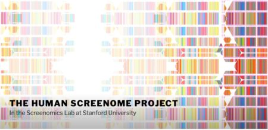
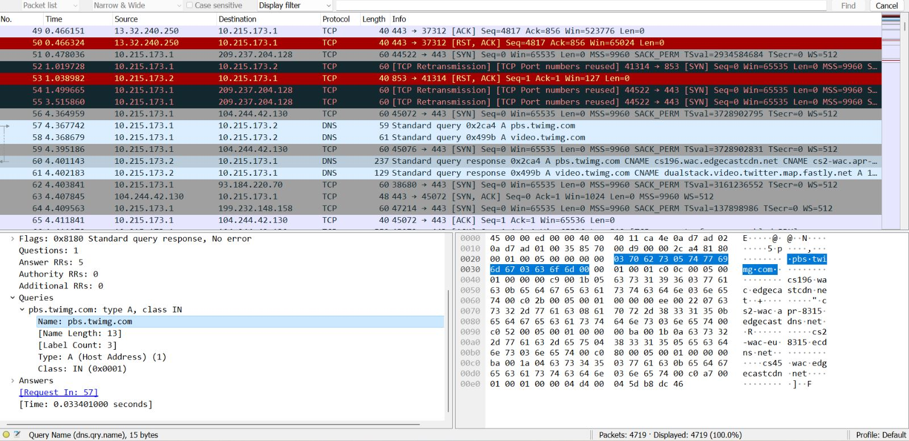
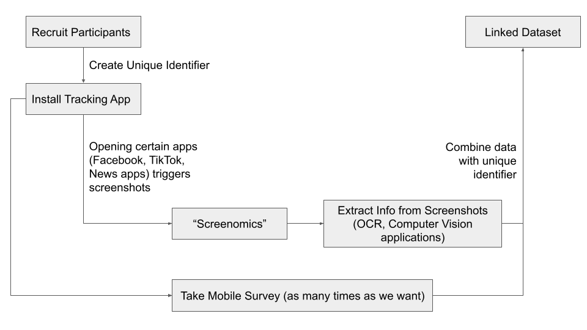
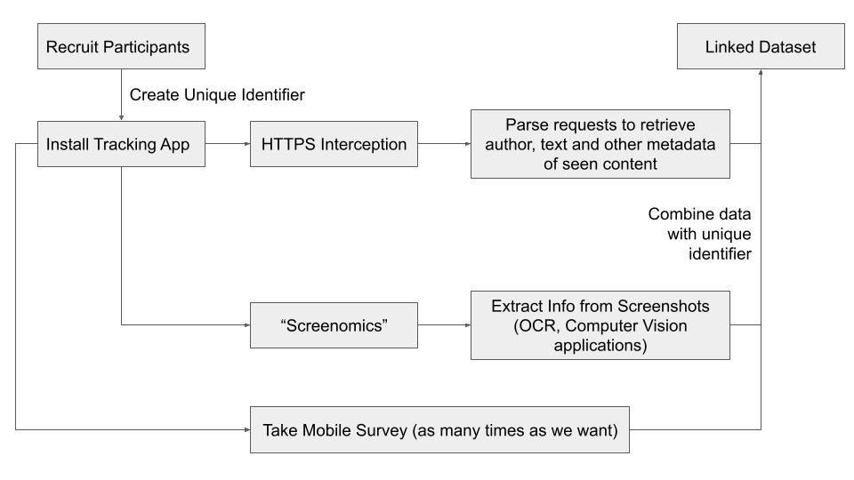
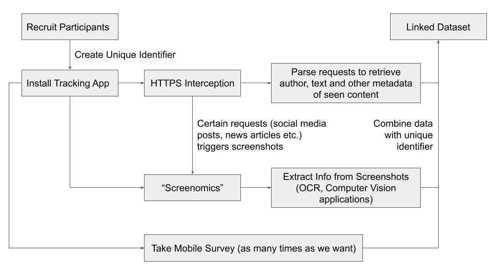

layout: true

<style>
.onehundredtwenty {
  font-size: 120%;
   }

<style>
.ninety {
  font-size: 90%;
   }

.eightyfive {
  font-size: 85%;
   }
   
.eighty {
  font-size: 80%;
   }
   
.seventyfive {
  font-size: 75%;
   }
   
.seventy {
  font-size: 70%;
   }
   
.fifty {
  font-size: 50%;
   }
   
.forty {
  font-size: 40%;
   }
</style>


```{r meta, echo=FALSE, warning=F, message=F}

library(gt)
library(gtExtras)
library(metathis)
meta() %>%
  meta_general(
    description = "Mobile News Exposure",
    generator = "xaringan and remark.js"
  ) %>%
  meta_name("github-repo" = "favstats/xxx") %>%
  meta_social(
    title = "Mobile News Exposure",
    url = "https://www.favstats.eu",
    og_type = "website",
    og_author = "Fabio Votta",
    twitter_card_type = "summary_large_image",
    twitter_creator = "@favstats"
  )
```


```{r setup, include=FALSE}
# dateWritten <- format(as.Date('2020-05-04'), format="%B %d %Y")
workshop_day <- format(as.Date("2022-06-28"), format="%B %d %Y")
pacman::p_load(tidyverse, fontawesome, tidyverse, knitr, xaringanthemer)

options(
    htmltools.dir.version = FALSE,
    knitr.table.format = "html",
    knitr.kable.NA = ""
)
knitr::opts_chunk$set(
    warning = FALSE,
    message = FALSE,
    fig.path = "figs/",
    fig.width = 7.252,
    fig.height = 4,
    comment = "#>",
    fig.retina = 3 # Better figure resolution
)


# Enables the ability to show all slides in a tile overview by pressing "o"
xaringanExtra::use_tile_view()
xaringanExtra::use_panelset()
xaringanExtra::use_clipboard()
# xaringanExtra::use_share_again()
# xaringanExtra::style_share_again(share_buttons = "all")
xaringanExtra::use_extra_styles(
  hover_code_line = TRUE,
  mute_unhighlighted_code = FALSE
)
# xaringanExtra::use_webcam()


knitr::opts_chunk$set(warning = F, message = F, echo = F) # Whether to display errors
```


---
name: title-slide
class: title-slide, center, middle


<div class="my-logo-right"></div> 

<br>

# .font100[`r rmarkdown::metadata$title`]

### .font90[`r rmarkdown::metadata$subtitle`]

*Job Interview for Postdoc in Computational Communication Science*

By: Fabio Votta

[`r fa(name = "mastodon", fill = "white")` @favstats@fosstodon.org](https://fosstodon.org/@favstats)<br>
[`r fa(name = "twitter", fill = "white")` @favstats](http://twitter.com/favstats)<br>
[`r fa(name = "github", fill = "white")` @favstats](http://github.com/favstats)<br>
[`r fa(name = "globe", fill = "white")` favstats.eu](https://www.favstats.eu)


24th February 2023

<!-- .fifty[Link to slides: [favstats.github.io/WarwickSpringCamp_QTA/slides/day1/](https://favstats.github.io/WarwickSpringCamp_QTA/slides/day1/)] -->


---

### Goal


> Design a study that combines *individual level survey responses* with *digital trace data from mobile phones*


In this (hypothetical) study we want to research:


*How and when people consume news on their phone via news apps or social media feeds?*

---

### Methodology

There are two ways to collect digital trace data from mobile phones

--

.pull-left[

+ **"Screenomics"** (Reeves et al. 2019)

    + capture screenshots every X seconds
    
    + Automated parsing of content (OCR, ML applications)
    
    + Downside: data privacy (for example: private messages, photographs)

]

.pull-right[




]


---


### Methodology

There are two ways to collect digital trace data from mobile phones

--

.pull-left[

+ **Network Traffic Interception** (Jürgen, Stark, and Magin 2019)

    + capture HTTP(S) requests and reroute to researchers (or collect via data donation)
    
    + Automated parsing of (relevant) requests made from phone
    
    + Downside: hasn't been done before, technically challenging
]

.pull-right[





Screenomics & Interception both require tracking apps to be installed on the participant's phone


]

--


---

### Study Design



---

### Study Design



---

### Study Design




---

class: middle, center

# That's it! Thank you for listening!


<!-- <div style="text-align: center;"> -->
<!--     <div style="display: inline-block; text-align: left;"> -->
<!-- <p align="left">`r icons::icon_style(icons::fontawesome("twitter"),fill="blue")`&nbsp;@favstats <br> `r icons::icon_style(icons::fontawesome("mastodon"),fill="#615ff7")`&nbsp;@favstats@fosstodon.org</p> -->
<!--     </div> -->
<!-- </div> -->

.pull-left[


.font60[

Ram, N., Yang, X., Cho, M.-J., Brinberg, M., Muirhead, F., Reeves, B., & Robinson, T. N. (2019). Screenomics: A New Approach for Observing and Studying Individuals’ Digital Lives. Journal of Adolescent Research, 35(1), 16–50. https://doi.org/10.1177/0743558419883362

Jürgens, P., Stark, B., & Magin, M. (2020). Two Half-Truths Make a Whole? On Bias in Self-Reports and Tracking Data. Social Science Computer Review, 38(5), 600–615. https://doi.org/10.1177/0894439319831643

]


]

.pull-right[


]


